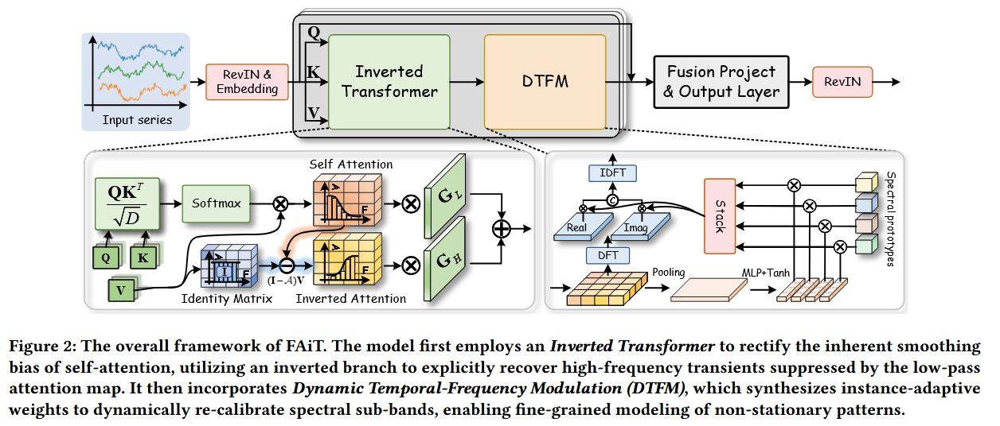
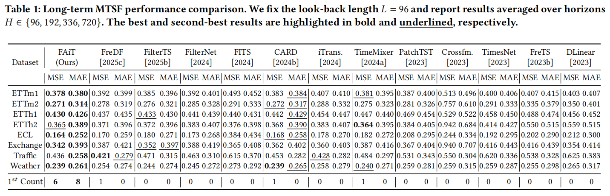
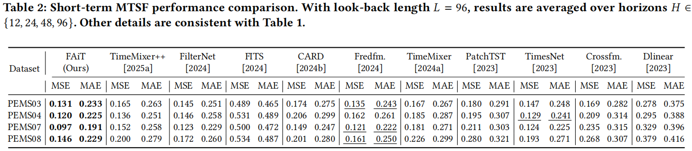
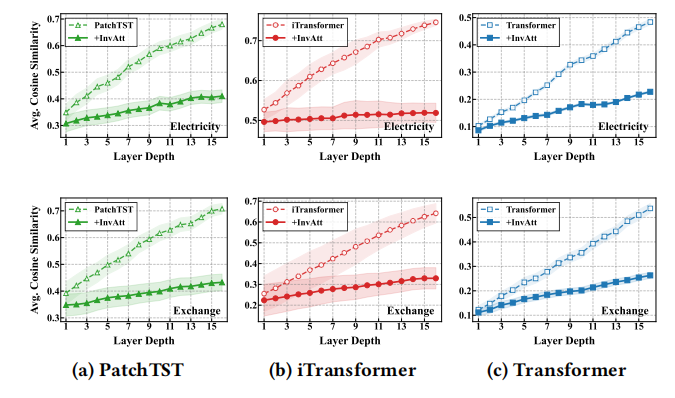
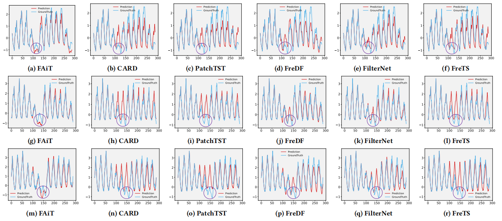

# 🌟 FAiT: Frequency-Aware Inverted Transformer for Multivariate Time Series Forecasting

<p align="center">
  <a href="https://anonymous.4open.science/r/FAIT-main"></a>
  <a href="https://github.com/your-username/FAiT"></a>
  <a href="https://pytorch.org/"></a>
  
</p>

> **Official PyTorch Implementation of the KDD 2026 paper:** > *FAiT: Frequency-Aware Inverted Transformer for Multivariate Time Series Forecasting*

---

## 💡 Motivation 

While Transformer-based architectures have dominated Multivariate Time Series Forecasting (MTSF), their core self-attention mechanism inherently functions as a **low-pass filter**. This systematically smooths out high-frequency signals that are vital for capturing sharp local changes and transient dynamics in real-world scenarios. 

FAiT is proposed to explicitly rectify this spectral bias internally, enabling fine-grained control over evolving multi-scale patterns without relying on fixed spectral bases.

<p align="center">
  
  <br>
</p>


---

## 🚀 Highlights & Core Architecture

FAiT achieves state-of-the-art performance through two novel complementary components:

* **🔄 Inverted Attention:** Interprets the standard attention map as a learnable low-pass operator and explicitly constructs a complementary high-pass branch by inverting the attention matrix. This recovers attenuated transient signals and mitigates over-smoothing.
* **🎛️ Dynamic Temporal-Frequency Modulation (DTFM):** Synthesizes instance-conditioned weights to adaptively re-calibrate the energy of spectral sub-bands, providing fine-grained, dynamic control over time-varying frequency responses.

<p align="center">
  
  <br>
</p>


---

## 🏆 Main Results

FAiT consistently outperforms state-of-the-art Transformer-based and frequency-enhanced baselines on multiple real-world benchmarks.

### Long-term Forecasting
FAiT achieves the best or second-best performance in the vast majority of cases across diverse domains (e.g., ETT, Electricity, Traffic, Weather).

<p align="center">
  
  <br>
</p>

### Short-term Forecasting 
On complex urban traffic datasets (PEMS03/04/07/08), FAiT demonstrates consistent superiority, remaining highly effective under volatile spatial-temporal dynamics.

<p align="center">
  
  <br>
</p>

### Qualitative Visualization

#### **Self-attention Analysis**

<p align="center">
  
  <br>
</p>

#### **Qualitative Analysis of Non-Stationarity**

<p align="center">
  
  <br>
</p>

---

## 🛠️ Getting Started

### 1. Environment Setup
Clone the repository and install the required dependencies:
```bash
cd FAiT
pip install -r requirements.txt
```

### 2. Data Preparation

The benchmarks used in the paper can be downloaded directly via the following links:

- 🌐 **[Google Drive]** [Download Datasets](https://drive.google.com/file/d/1l51QsKvQPcqILT3DwfjCgx8Dsg2rpjot/view?usp=drive_link)
- 🌐 **[Tsinghua Cloud]** [Download Datasets](https://cloud.tsinghua.edu.cn/f/2ea5ca3d621e4e5ba36a/)

> 💡 *Note: For other datasets, please refer to the data download links provided in our supplementary material.*

### 3. Training & Evaluation

We provide ready-to-use shell scripts under the `./scripts/` directory to quickly reproduce the main results reported in our paper.

```
# Run FAiT on the ECL dataset
bash ./scripts/ecl/ECL_FAiT.sh

# Run FAiT on the ETTh1 dataset
bash ./scripts/ETT/ETTh1_FAiT.sh
```

------

## 📌 Citation

If you find our work or code useful for your research, please consider citing our KDD 2026 paper:

```

```

------

## 🙏 Acknowledgements

We sincerely appreciate the authors of the following open-source repositories for their valuable codebases and contributions:

- [iTransformer](https://github.com/thuml/iTransformer)
- [FreEformer](https://github.com/jackyue1994/FreEformer)
- [Time-Series-Library](https://github.com/thuml/Time-Series-Library)
- [Fredformer](https://github.com/chenzRG/Fredformer)
- [Leddam](https://github.com/Levi-Ackman/Leddam)
